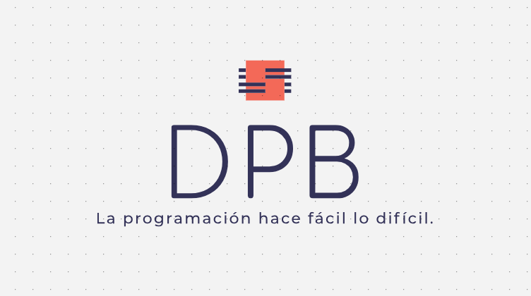

  

<h3 align="center">Soy un Desarrollador Web de 23 años de edad que actualmente se encuentra en España. Me considero apasionado pero lo digo porque es lo que pone todo el mundo pero lo que considero mas importante es que no me gusta rendirme.</h3>

- 🌱 I’m currently learning **JavaScript, Bootstrap, ReactJS y PHP.**

- 📫 How to reach me **dpb28fpb@gmail.com**

<h3 align="left">Languages and Tools:</h3>

 

 

